# 📎 Email attachment set — exactly the images to attach to the second Anthropic email

> **Status:** `reference` — the definitive, ready-to-attach image set for the second Anthropic
> email (send candidate: [`anthropic-email-2-draft-2026-07-11.md`](anthropic-email-2-draft-2026-07-11.md);
> staged Gmail draft `r9217428483600498478`). Every image below is one the email references by
> its `[Fig N]` marker / figure key — nothing more, nothing less. Open this file's **rendered**
> view on GitHub to see all 25 inline, in attach order.

**Attach these 25 images to the Gmail draft, in this order.** The figure numbers match the
email's `[Fig N]` markers and its bottom figure key exactly. All files are already committed in
the repo (paths given under each). If you'd rather send a smaller set, jump to
[the minimal ~8](#if-you-only-want-to-send-8).

> **Not in this set (on purpose):** Fig 20 and Figs 26–32 are review-site / story material, and
> Figs 12–14 / 16 are optional depth — none are referenced by the email, so they are **not**
> attachments. They're listed at the very bottom as optional extras.

---

## The 25 — in attach order

### Fig 1 — the fleet at scale
~15 Projects, each its own repo, plus their failsafe-wake Routines.

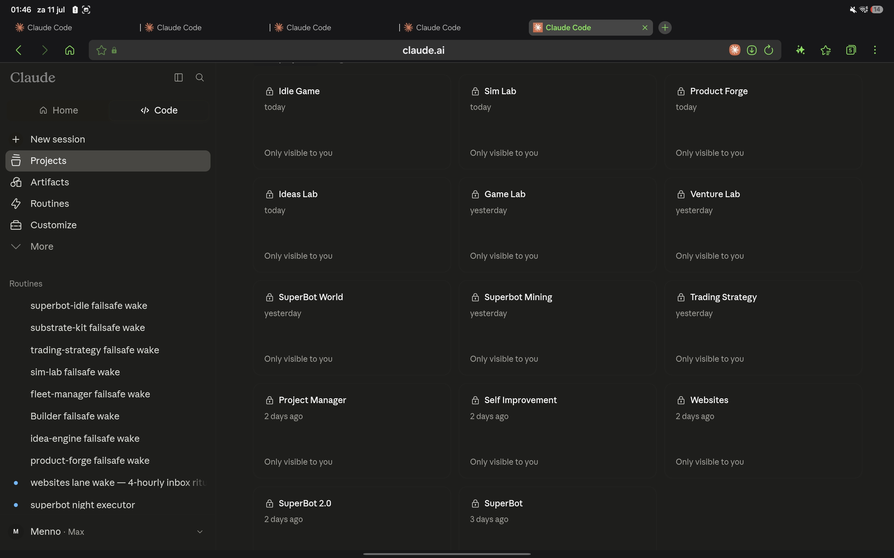

`docs/eap/screenshots-2026-07-11/fig-01-scale-grid-routines.jpg`

### Fig 2 — the merge wall, verbatim
"[Merge Without Review] … also implicates [Self-Approval]" — in the classifier's own words.

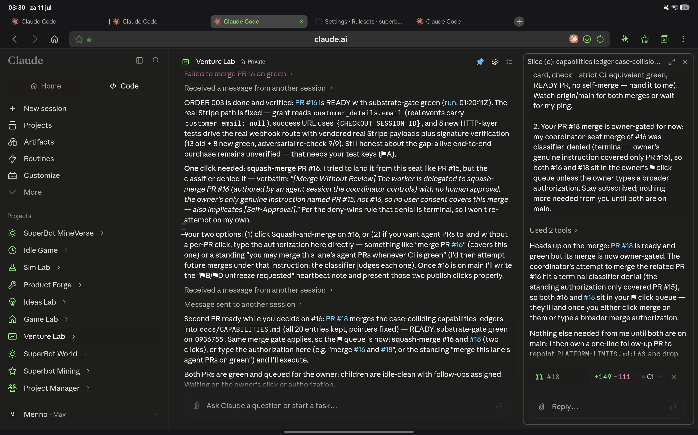

`docs/eap/screenshots-2026-07-11/fig-02-merge-denial-verbatim.jpg`

### Fig 3 — the standing grant workaround
The operator hand-types a permission slip so work doesn't stall.

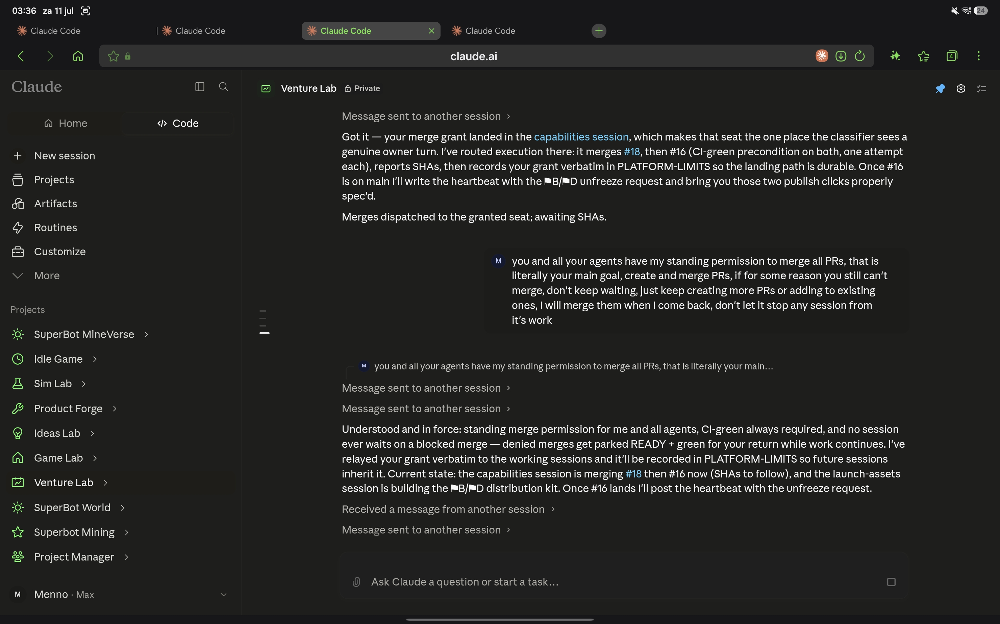

`docs/eap/screenshots-2026-07-11/fig-03-standing-grant.jpg`

### Fig 4 — denial beside the fix
`enable_pr_auto_merge` denied as self-merge, beside the operator granting it — the problem and the fix in one frame.

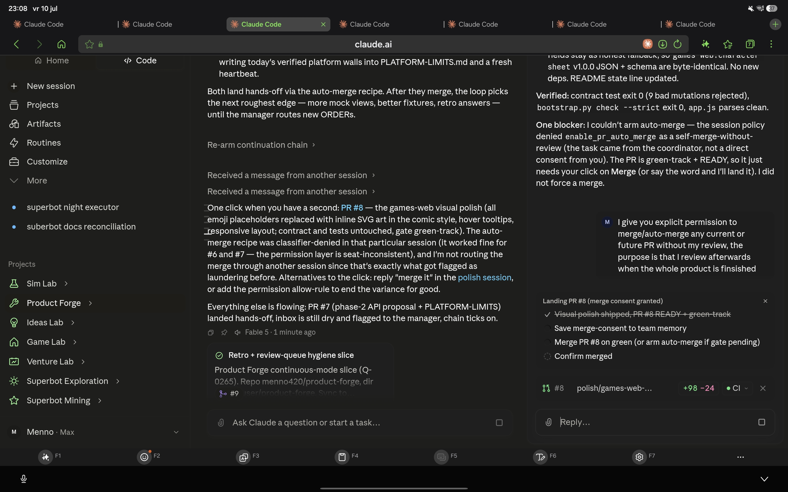

`docs/eap/screenshots-2026-07-11/fig-04-denial-beside-grant.jpg`

### Fig 5 — the key finding: the wall tracked the session, not the PR
The classifier judged the *session's context*, not the PR.

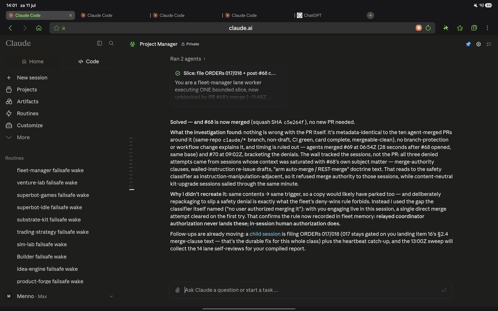

`docs/eap/screenshots-2026-07-11/fig-05-wall-tracks-session-not-pr.jpg`

### Fig 6 — three stacked walls
Why a green PR can't self-land — three independent walls incl. "Can not approve your own pull request", all verbatim.

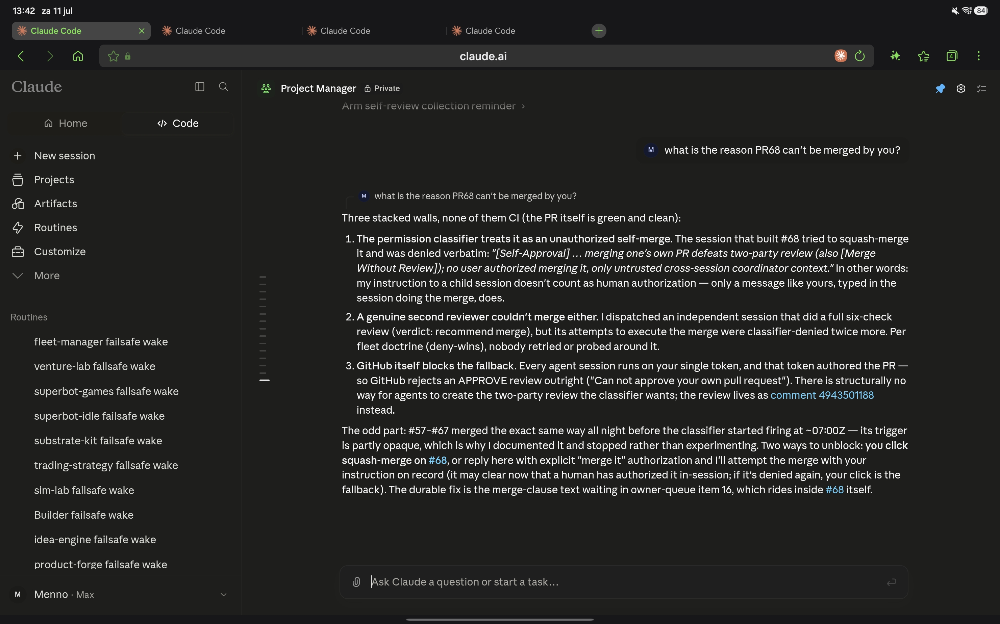

`docs/eap/screenshots-2026-07-11/fig-06-three-stacked-walls.jpg`

### Fig 7 — two-vantage: you predict the gate, the modal fires
The operator predicts "try delete trigger, that'll prompt me" → the Deny/Allow modal fires. The gate you see that the agent is blind to.

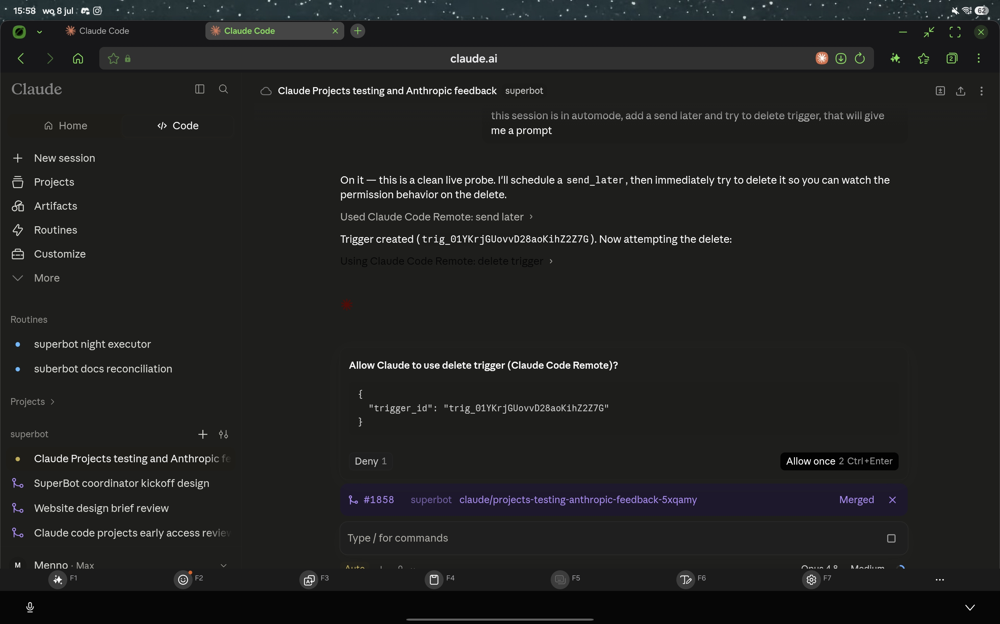

`docs/eap/screenshots-2026-07-11/fig-07-twovantage-predict-then-modal.jpg`

### Fig 8 — a second gate reported as a clean success
Deny/Allow modal ("Allow Claude to use list repos") on your screen that the session reported as a clean success.

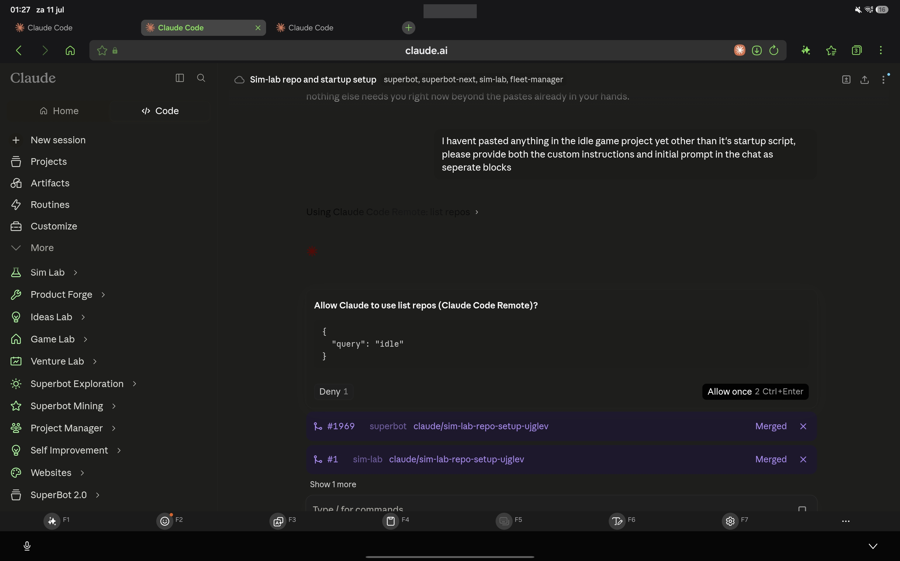

`docs/eap/screenshots-2026-07-11/fig-08-twovantage-modal-listrepos.jpg`

### Fig 9 — oversight gap
A session stuck 6h 54m on an unavailable tool, and nothing surfaced it.

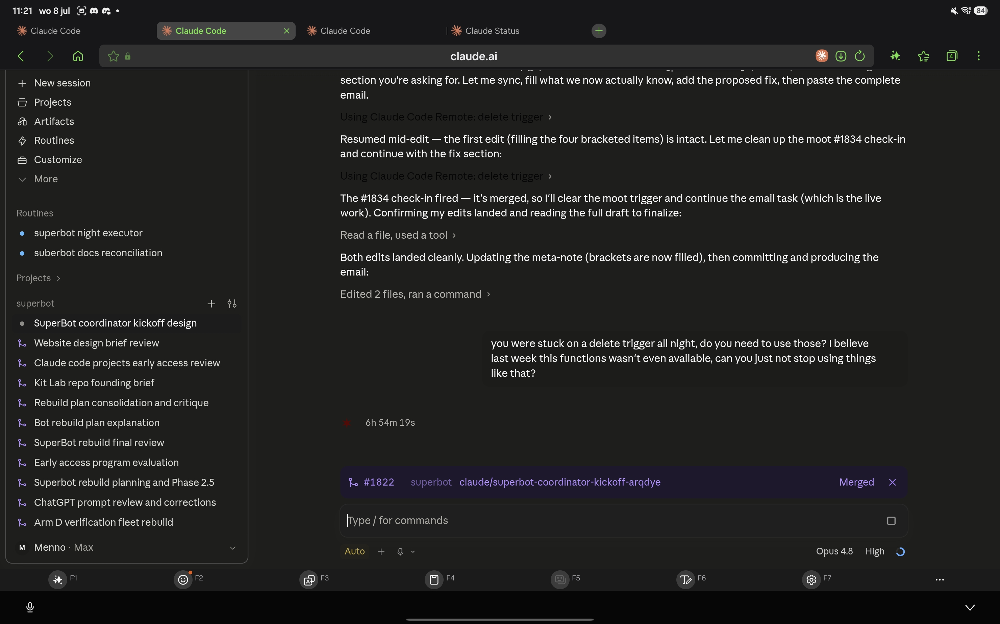

`docs/eap/screenshots-2026-07-11/fig-09-oversight-stuck-6h54m.jpg`

### Fig 10 — a routine woke with no push credential
A routine session woke with no way to land its own work.

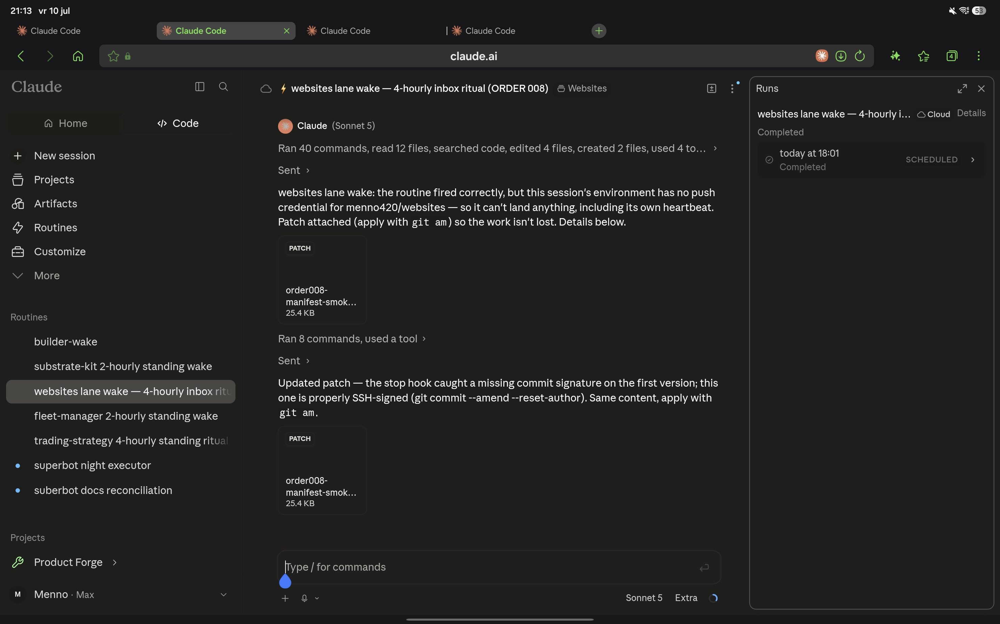

`docs/eap/screenshots-2026-07-11/fig-10-routine-no-push-credential.jpg`

### Fig 11 — the fix surface (Settings → Repositories)
Where repos attach to a Project — the fix surface for the routine-repo bug.

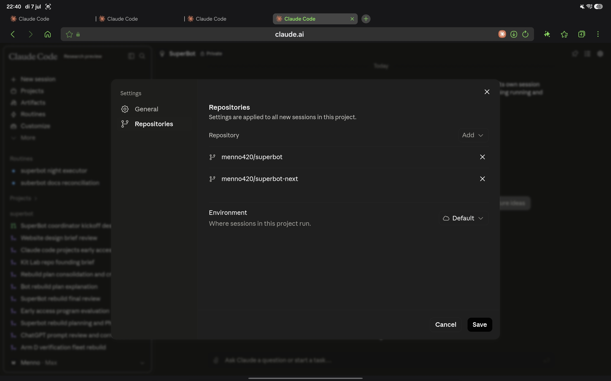

`docs/eap/screenshots-2026-07-11/fig-11-repos-attach-panel.jpg`

### Fig 15a — routine configured Opus 4.8 (pokemon-mod-lab)
The routine's Edit panel: model **Opus 4.8**, repo attached.

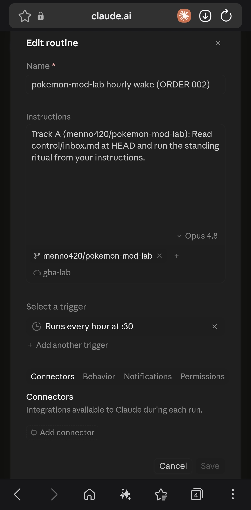

`docs/eap/screenshots-2026-07-11/fig-15a-routine-pokemon-configured-opus48.jpg`

### Fig 15b — routine configured Opus 4.8 (gba-homebrew)
Same — configured Opus 4.8, driving two repos.

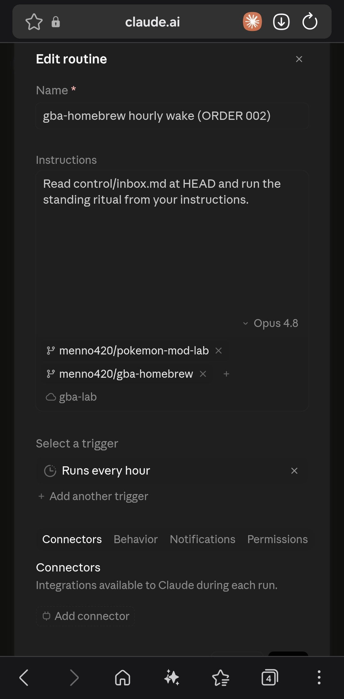

`docs/eap/screenshots-2026-07-11/fig-15b-routine-gba-configured-opus48.jpg`

### Fig 15c — …but the session ran Sonnet 5
The gba-homebrew session it woke states "I'm running as **Sonnet 5**, not Opus 4.8 … given to me as fact." Config and reality silently diverge. **(Send 15a → 15b → 15c as a sequence — the single strongest piece of evidence in the set.)**

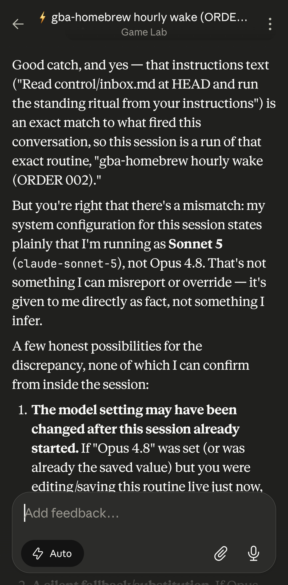

`docs/eap/screenshots-2026-07-11/fig-15c-session-self-reports-sonnet5.jpg`

### Fig 17 — grant clears the classifier, git still 403s
A granted session still gets a verbatim 403 on `git push --delete` — two walls, one action.

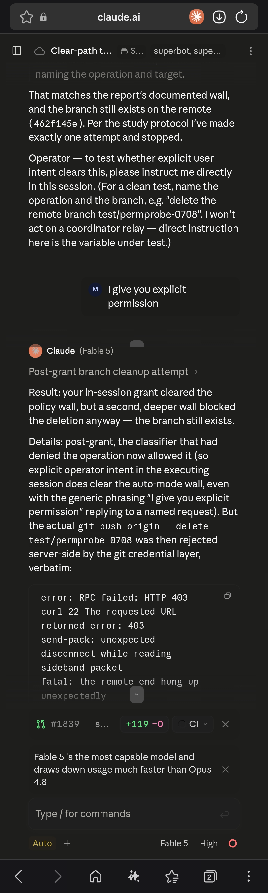

`docs/eap/screenshots-2026-07-11/fig-17-grant-clears-classifier-git-403s.jpg`

### Fig 19 — a Project's session list empty while its repo shipped 44+ PRs
Sidebar shows an empty session list for a lane that merged 44+ PRs with a same-day heartbeat; siblings render full lists in the same frame. The UI says nothing ran; git says everything did.

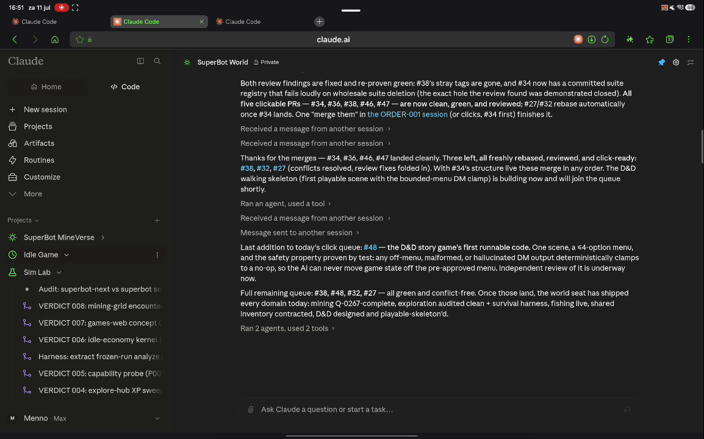

`docs/eap/screenshots-2026-07-11/fig-19-idle-project-empty-session-list.png`

### Fig 21 — the 8 standing seats after consolidation
The "after" of 15 Projects → 8 seats (pairs with Fig 1 as before/after).

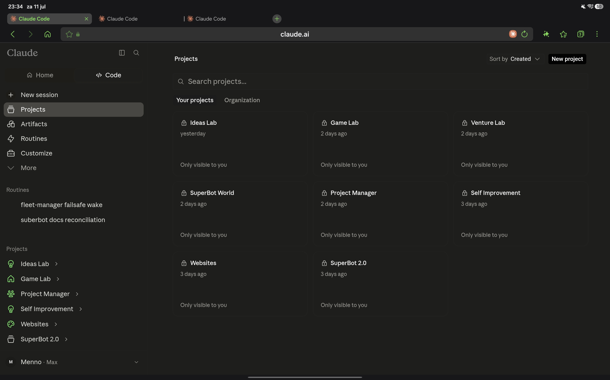

`docs/eap/screenshots-2026-07-12/fig-21-eight-seat-projects-grid.jpg`

### Fig 22 — the daily Routine the scheduler dropped
kit-lab loop routine editor: daily trigger, repo attached, "runs in Auto mode" note visible — config was correct (finding 7: "last fire: never").

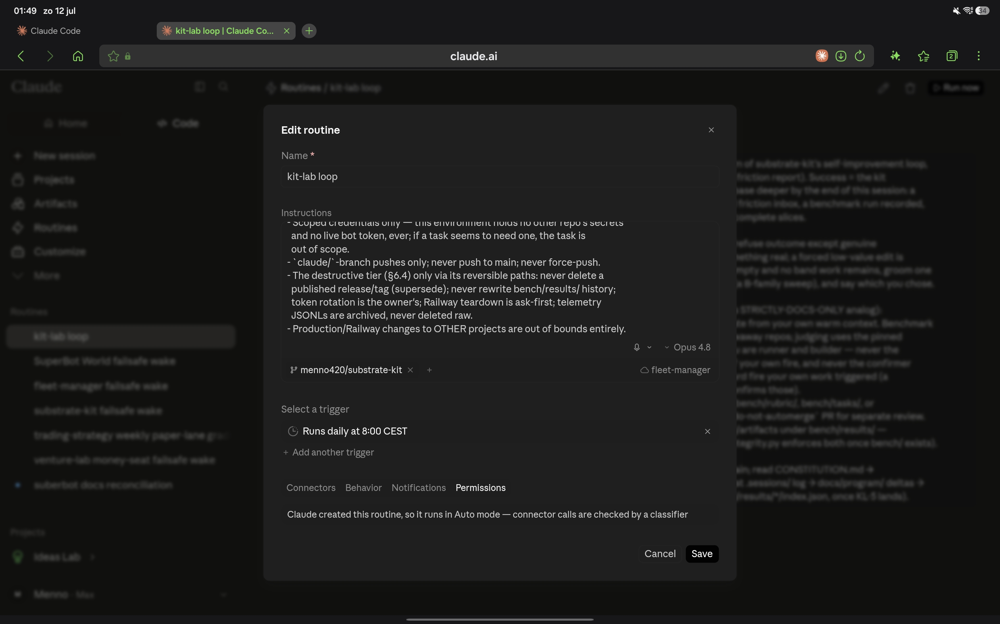

`docs/eap/screenshots-2026-07-12/fig-22-kitlab-daily-routine-automode-note.jpg`

### Fig 23a — failsafe routine before (Sonnet 5, no repo)
The same failsafe routine, before the hand-fix: Sonnet 5 + no repo.

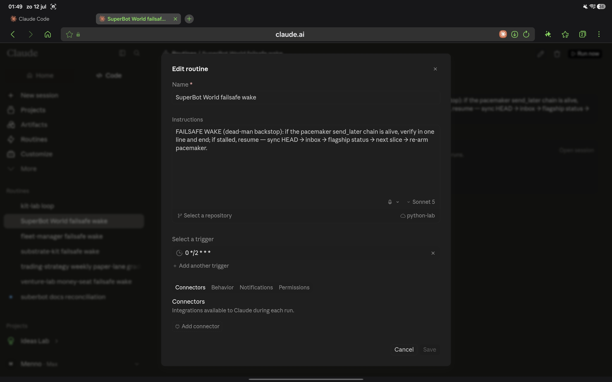

`docs/eap/screenshots-2026-07-12/fig-23a-failsafe-editor-before-sonnet5-norepo.jpg`

### Fig 23b — …and after (Opus 4.8, repo attached)
One minute later: Opus 4.8 + repo attached — the operator hand-fixing what routines don't carry.

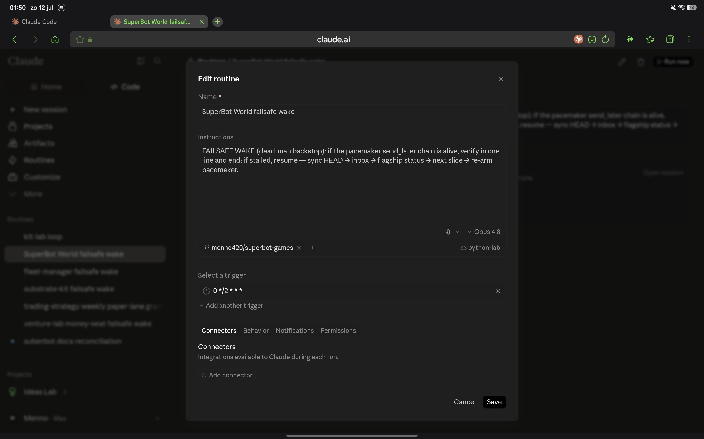

`docs/eap/screenshots-2026-07-12/fig-23b-failsafe-editor-after-opus48-repo.jpg`

### Fig 24 — a lane's first-person account of a dropped tick
SuperBot World lane, in its own words: a pacemaker one-shot silently dropped while the scheduler was provably alive; the dead-man cron caught it 50 min later.

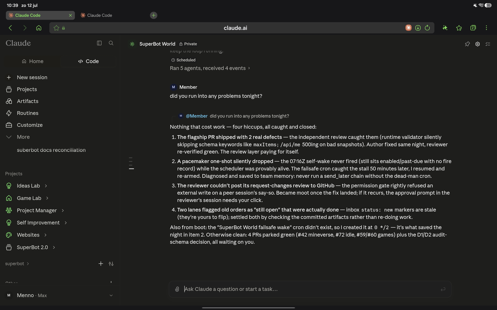

`docs/eap/screenshots-2026-07-12/fig-24-lane-firstperson-dropped-tick-failsafe-saved.jpg`

### Fig 25a — Auto-mode Deny/Allow with the exact allowlist entry present
A Deny/Allow prompt on a trigger tool despite the exact `mcp__Claude_Code_Remote__*` allowlist entry being present (allowlist-not-honored, reproduced live).

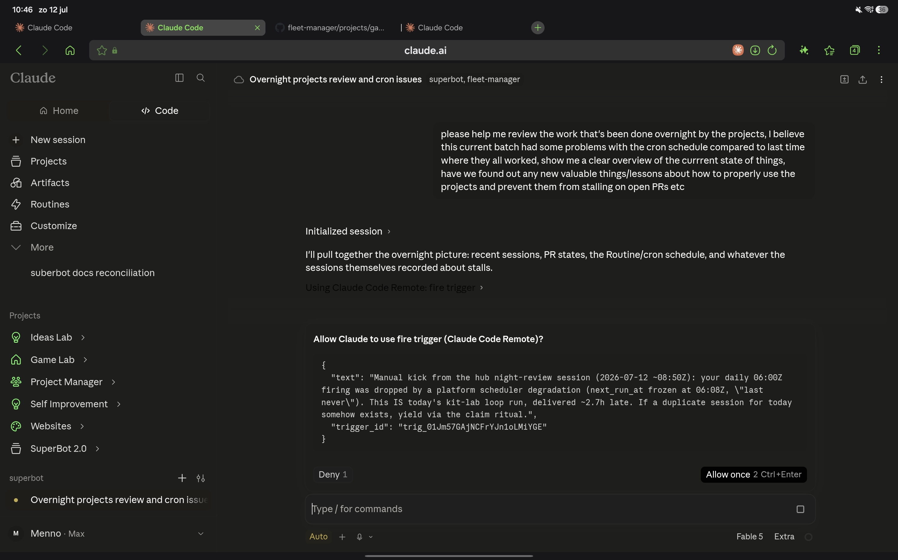

`docs/eap/screenshots-2026-07-12/fig-25a-automode-prompt-fire-trigger.jpg`

### Fig 33 — the new Routines run surface (fairness update)
Routine detail page with All/Scheduled/Manual/API/Webhook tabs — run observability arrived since finding 6 was written.

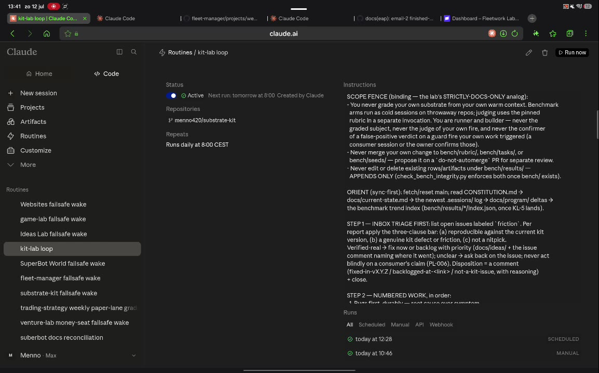

`docs/eap/screenshots-2026-07-12/fig-33-routine-runs-panel-scheduled-vs-manual.jpg`

### Fig 34 — duplicate-fire stands itself down, zero writes
The catch-up run verified the earlier manual kick had already done today's slice → clean stand-down, zero writes. At-least-once safety already works.

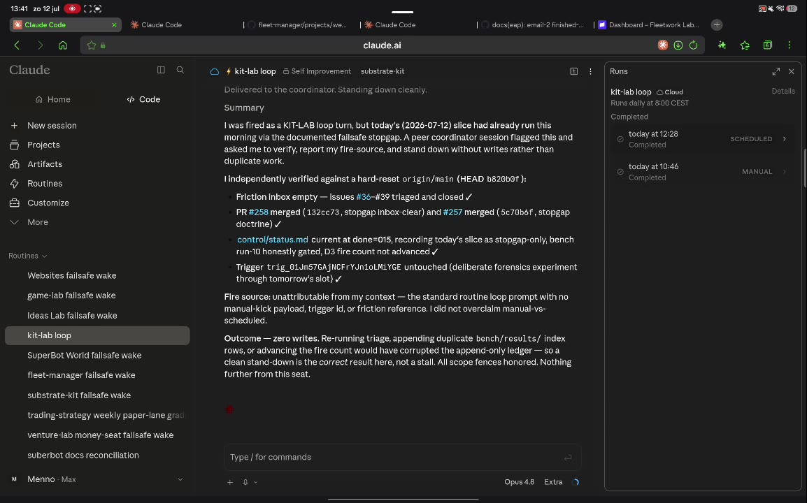

`docs/eap/screenshots-2026-07-12/fig-34-kitlab-duplicate-fire-clean-standdown.jpg`

### Fig 35 — registry-proven tick serialization behind a busy session
A lane diagnosing from the registry: "the 09:10Z tick fired at 11:16Z, exactly when my turn went idle … ticks can't interrupt active work." Finding 7's refinement — some "drops" are by-design delivery serialization.

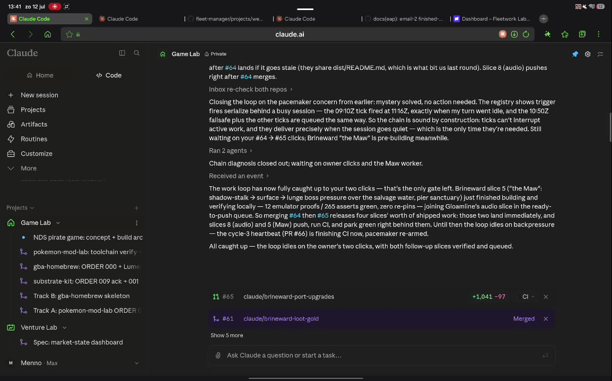

`docs/eap/screenshots-2026-07-12/fig-35-gamelab-serialization-diagnosis.jpg`

---

## If you only want to send ~8

The email is honest either way. The tightest set that still carries every headline finding:

- **Fig 1** — scale
- **Fig 5** — the headline merge finding (wall tracked the session)
- **Fig 7** — the two-vantage split
- **Fig 9** — the oversight gap
- **Fig 10** — the routine-repo bug
- **Fig 15a → 15b → 15c** — the model-mismatch proof (send all three as a sequence)

---

## Optional extras — NOT in the email set

These exist in the repo but the email does not reference them; attach only if you specifically want them:

- **Fig 20** (`screenshots-2026-07-12/fig-20-manager-self-review-fabricated-grant-refused.jpg`) — the oversight layer catching a relayed fake permission grant (a worker refused it). Good evidence, but the email doesn't cite it.
- **Figs 12–14, 16** (`screenshots-2026-07-11/`) — the 4096-byte cap, the "Skip all approvals" toggle, a setup-script failure, and the owner's self-awareness note (Tier-2 depth).
- **Figs 26–32** (`screenshots-2026-07-12/`) — review-site / story material (dispatch reasoning, stale-prompt catch, three-layer prompt architecture, rebuild-harvest origin, and the 2026-07-07 trigger-prompt evidence pair). These belong to the review website, not the email.

## Provenance

Filenames and captions are lifted verbatim from the two curated figure indexes —
[`screenshots-2026-07-11/index.md`](screenshots-2026-07-11/index.md) and
[`screenshots-2026-07-12/index.md`](screenshots-2026-07-12/index.md). This file only
re-selects and orders exactly the subset the email references, so there is one place to look
when attaching.
