<!-- badge: audit -->
# Verification record — program design system · botsite v2 · program console (PR #1802)

> **Status:** `audit` — the rendered-proof record for the 2026-07-07 last-Fable-day design session
> (brief: [`website-design-fable-brief-2026-07-07.md`](website-design-fable-brief-2026-07-07.md)).
> Everything below was verified **live** against the running FastAPI app in real Chromium.
> Screenshots: [`assets/website-v2-2026-07-07/`](assets/website-v2-2026-07-07/) (12 curated of the
> 72 captured — every page × dark/light × 375/768/1280).

## What shipped (all new files; v1's three design-owned files untouched)

| Surface | Where | Route |
|---|---|---|
| Program design system | `botsite/ds/` (tokens.css · components.css · ds.js) | assets under `/ds/*` |
| Living style guide | `botsite/ds/styleguide.{html,js}` | `/design` |
| Botsite v2 (public site) | `botsite/site/v2/` | `/v2` (and `/` when `BOTSITE_FRONTEND=v2`) |
| Program console | `botsite/console/` + `botsite/data/console.json` | `/console` |
| UX regression harness | `tools/web_ux/` | local CLI |

## How it was verified

1. **Palette validation (dataviz skill):** chart hues + status sets run through
   `validate_palette.js` against the real surfaces, both themes. Single-hue magnitude bars;
   status colors never color-alone (icon + label everywhere). The one deliberate deviation:
   stat-tile values wear the brand green + display face (the neon identity is the owner's
   anchor) — documented, flagged below.
2. **Task-success checklist (the pragmatic "sim-decides" check):** 10 canonical user tasks with
   interaction budgets, driven in Chromium — **10/10 PASS within budget** (find a command ≤3,
   status ≤1, mobile menu→commands ≤2, palette lookup ≤3, real bug-report path ≤4, deep link 0).
3. **Nav coverage:** every area/feature/game + sampled command routes render (no 404s).
4. **Perf budgets:** v2 shell 118 KB (budget 150 KB) · data layer 251 KB (budget 600 KB).
5. **A11y budgets:** landmarks, labeled controls, exactly-one-h1, and token-contrast floors
   measured on the rendered page — **both themes PASS** (the harness caught and forced the light
   `--sb-ink-4` fix: 2.7:1 → 4.1:1).
6. **Verification fleet (25 subagents):** five review lenses (code correctness, deep a11y, visual
   QA over all 72 screenshots, IA/copy honesty, DS conformance) produced 40 findings; adversarial
   verification + a fix wave addressed ~20 real ones — highlights: hash-router crash on malformed
   percent-encoding, invisible keyboard focus ring, a fabricated 60-day status history (removed —
   no fake data), console feed honesty (bug states parsed from the book's verdict convention,
   feed-cap disclosure), true mobile viewport width on every page (was 568 px ghost width), and a
   correct combobox lifecycle for the ⌘K palette.
7. **CodeQL:** the 3 high alerts raised on the PR (`py/path-injection` via the `{asset}` routes)
   fixed by precomputing literal asset paths; request strings are now lookup keys only.

## Proof (curated; full set reproducible via `tools/web_ux/screenshot_pages.py`)

| Page | Dark | Light / other |
|---|---|---|
| Home (desktop) | 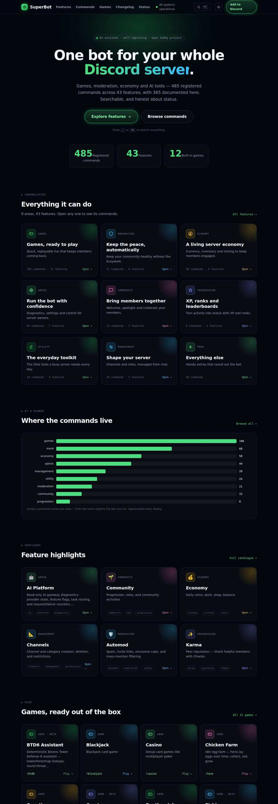 | 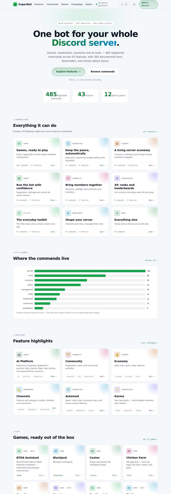 |
| Home (mobile 375) | 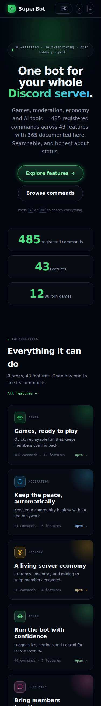 | — |
| Commands browser | 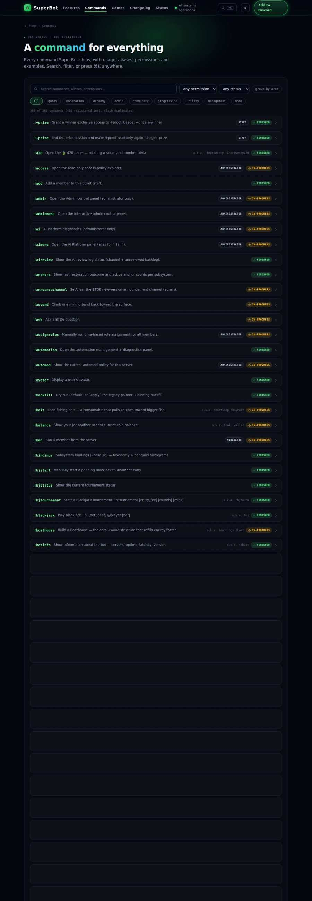 | 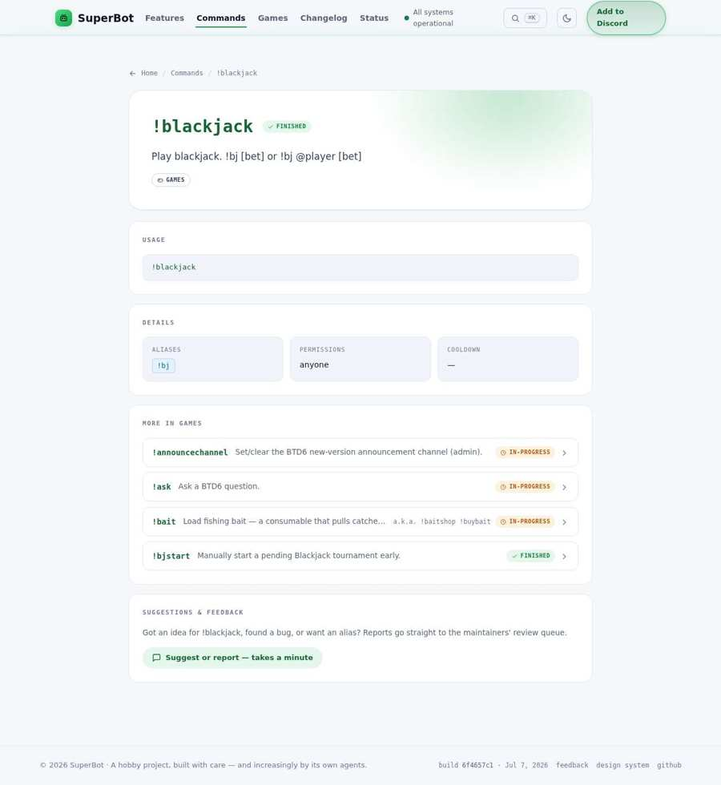 |
| Features catalogue | 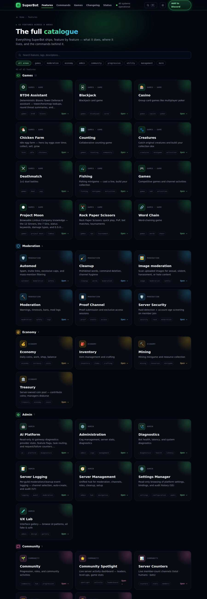 | 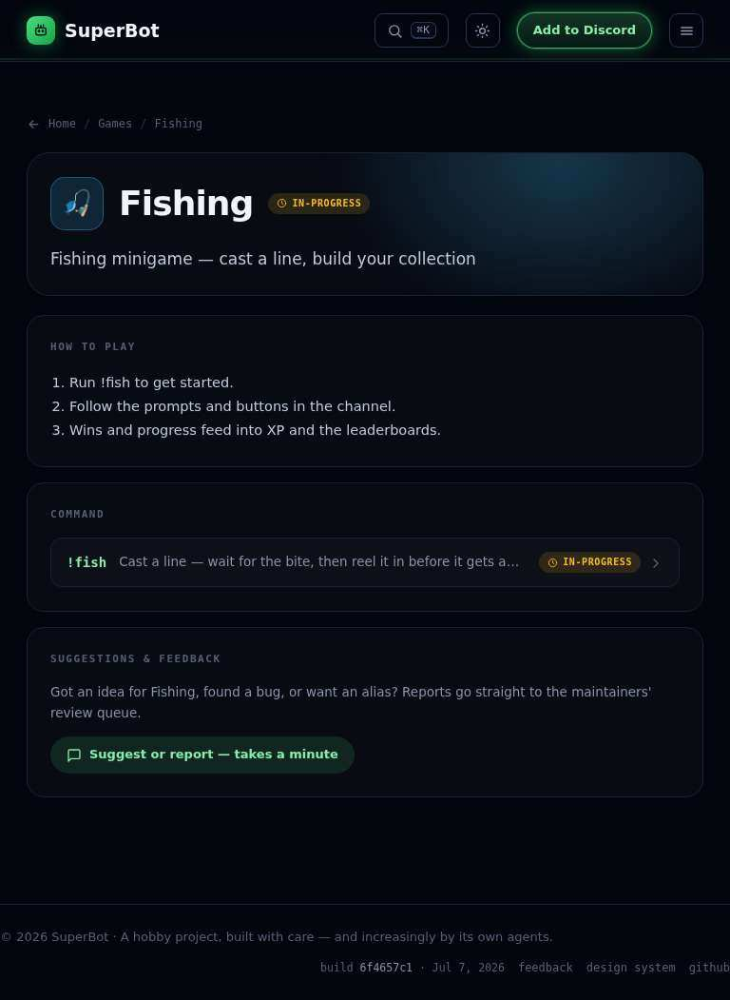 |
| Status (honest) | 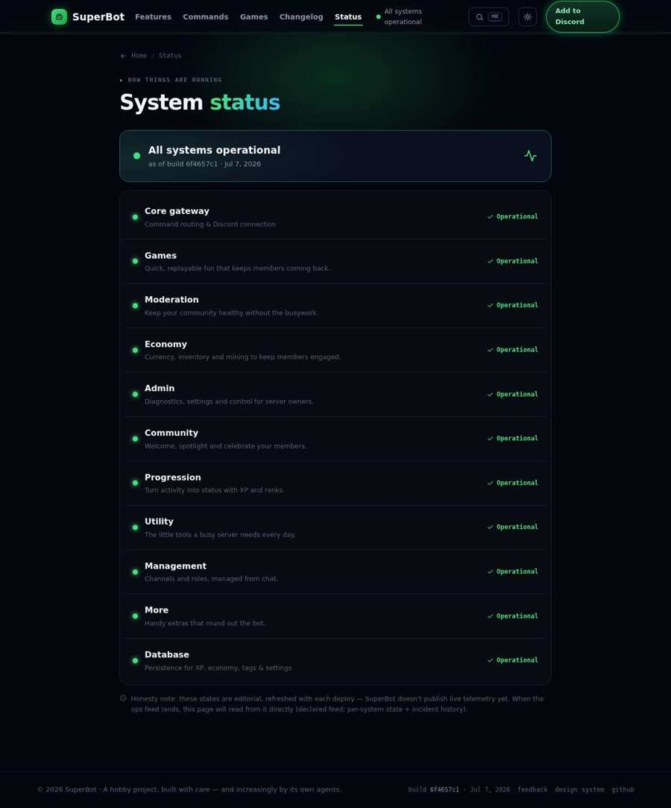 | — |
| Style guide | 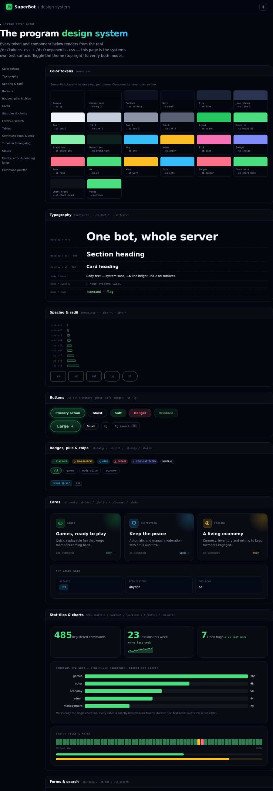 | 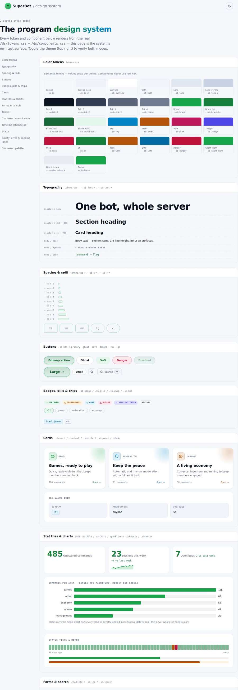 |
| Console | 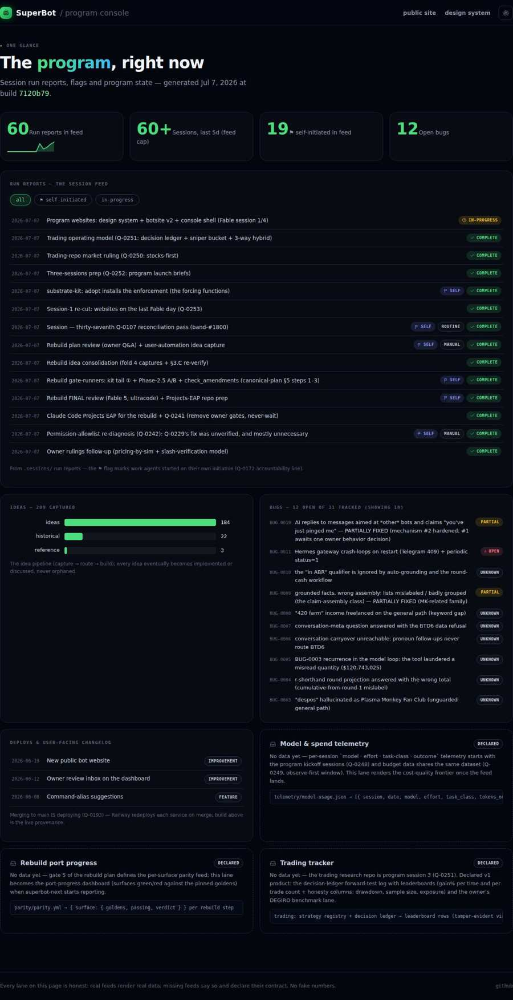 | 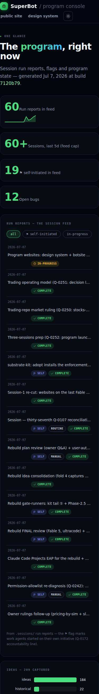 |

## Decide-and-flag register (Q-0240/Q-0241 — all reversible, veto by reacting)

- **⚑ No build step kept** — the design system + v2 are vanilla CSS/JS; the no-build property is
  why agents iterate the site cheaply. The React-migration plan is marked `historical`.
- **⚑ Console deploys as a route on the botsite service** (`/console`) rather than a new Railway
  project — the brief's own recommendation; moves at kit-extraction. Its feed
  (`console.json`) is whitelist-by-construction from repo-public families only, consistent with
  Q-0178 (dev pages public read-only).
- **⚑ v1 stays the default at `/`** — the owner flips by setting `BOTSITE_FRONTEND=v2` on the
  Railway botsite service (rollback = unset). v2 is live for review at `/v2` the moment this
  merges (merge = deploy, Q-0193).
- **⚑ Stat-tile values keep the neon brand voice** (green display numerals) — a deliberate,
  documented deviation from the dataviz hero-figure rule; the anchor look the owner asked to keep.
- **⚑ SBDATA extended additively** (FEATURES/BUILD/COUNTS/ADD_URL behind the frozen v1 export
  line) — v1 ignores the new families; the sync test pins generator ↔ committed artifact.

## Known deferrals (honest tail)

- Changelog summaries can arrive pre-truncated from the source changelog — data-side, not a
  v2 rendering bug.
- The status page's per-system states remain editorial (per-deploy); the page now says so and
  renders **no** per-day history until a real ops feed exists.
- `tools/web_ux/` runs locally only (Playwright isn't in CI's install set); wiring a manual
  `workflow_dispatch` CI job is a named follow-up idea.
